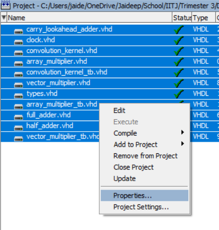
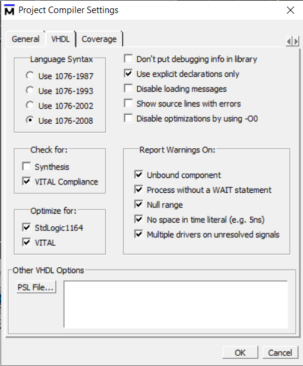
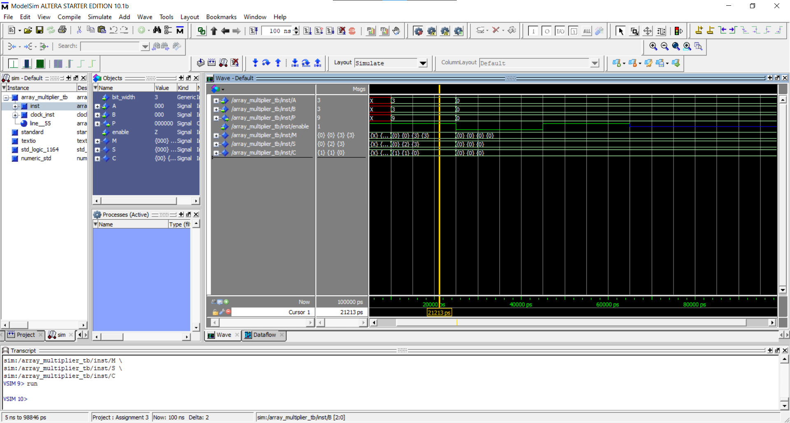
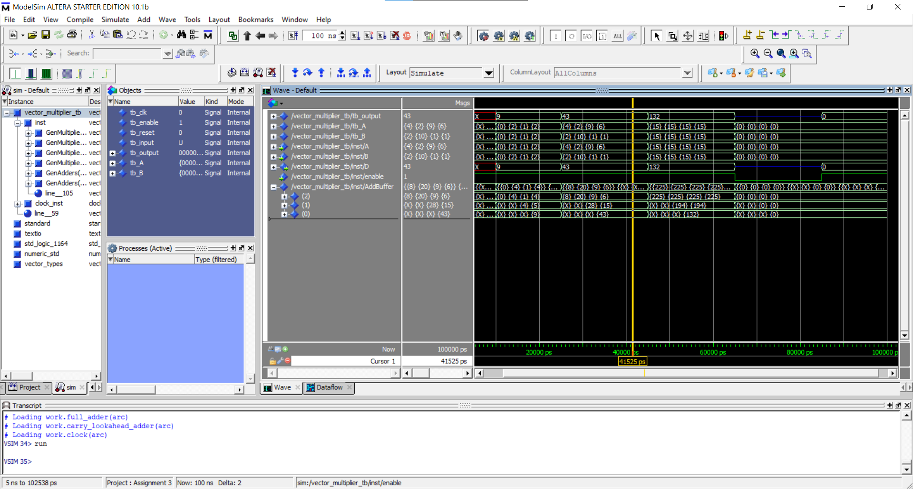
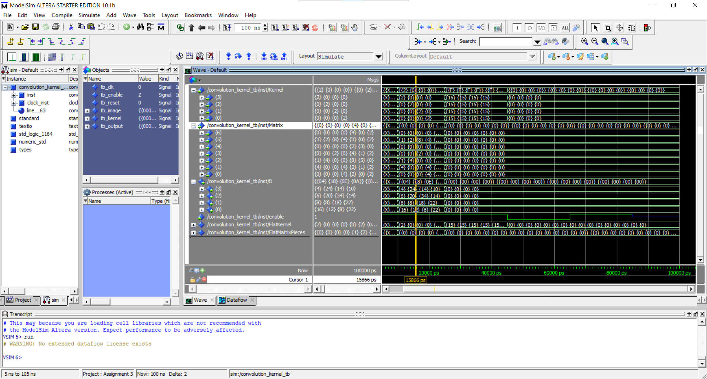

# Convolution Kernel in VHDL

## System design

The convolution kernel is designed as a combinational circuit to compute a convolution of `2^T * 2^T` kernel on any input matrix `M * M`.

This is achieved using [Carry Look-Ahead Adders](./src/carry_lookahead_adder.vhd) and [Array Multipliers](./src/array_multiplier.vhd).

First, [Vector Dot Product](./src/vector_multiplier.vhd) component is created using the Carry Look-Ahead Adders and Array Multipliers,
then these Vector Dot Product components are used to convolve the given kernel over the input matrix by treating both the kernel and the convolution area as one long flat vector and performing a dot product of both.

The full documentation can be found in [`Report.pdf`](./DOCS/Report-merged%20(2).pdf).

## Compilation Requirements

Compiling the code on ModelSim requires setting the VHDL language version to 2008 for all code files.

This is due to the definition of [`vector_T`](https://github.com/jaideepheer/vhdl_convolution_kernel/blob/4f493abb913c2a73d164184d771127da6b72def0/src/types.vhd#L5) and [`matrix_T`](https://github.com/jaideepheer/vhdl_convolution_kernel/blob/4f493abb913c2a73d164184d771127da6b72def0/src/types.vhd#L6) data types requiring some newer features.

To set the VHDL version,

-	Select all files in the project.
-	Right-click and click on properties.
-	Under the VHDL tab, select `Use 1076-2008` radio button for Language Syntax.
-	Click OK and compile all files.

|  |  |
|---|---|

## Results

### Array Multiplier

### Vector Multiplier

### Convolution Kernel

